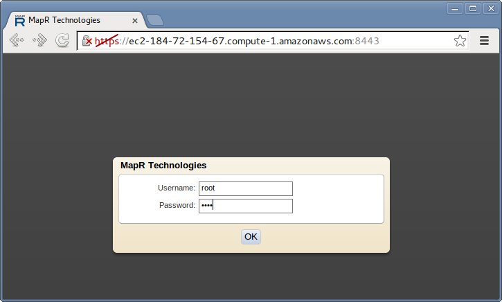
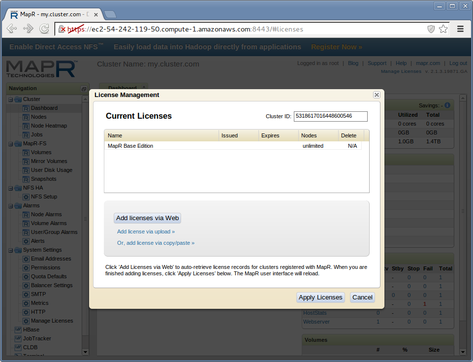

**********************
Build a test image web
**********************

First, connect to your IWCT

..  note::

    The following steps should all be done on your IWCT desktop.

Start a cluster
===============

Start a cluster with 5 nodes

.. code-block:: bash
  
  iwct_cluster create 5

While cluster is starting, you may skip to next section and come back.

When the prompt shows this message:
 
.. code-block:: bash
  
  log in to web ui and install license and start nfs service
  url: https://ec2-184-72-154-67.compute-1.amazonaws.com:8443`

Open the url in a browser (ignore the SSL warning this time)

.. note::

  Hover and right click on the url and click "open link in browser". 

""""""""""""""""""""""""""

  

Login as the root user.  

:Username: root
:Password: mapr

""""""""""""""""""""""""""

  
Click "add license from web"

""""""""""""""""""""""""""

If not yet done, create a Mapr account (set the remember me option to make this faster)

""""""""""""""""""""""""""

Select M3 license

""""""""""""""""""""""""""

Click "Return to your MapR Cluster Ui" link

""""""""""""""""""""""""""

Click "Apply Licenses" Button

""""""""""""""""""""""""""

go back to console and press any key to continue...

When the script finishes, the MapR control panel should look like this (one green square for each node you requested).

Load image dataset 
===========================

Download an example set of images

Pack images into a pert file

copy to the distributed file system

