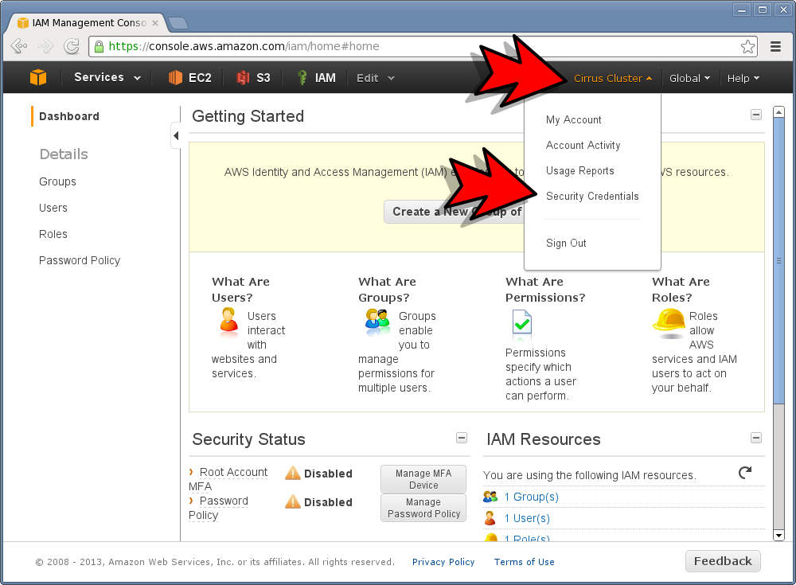
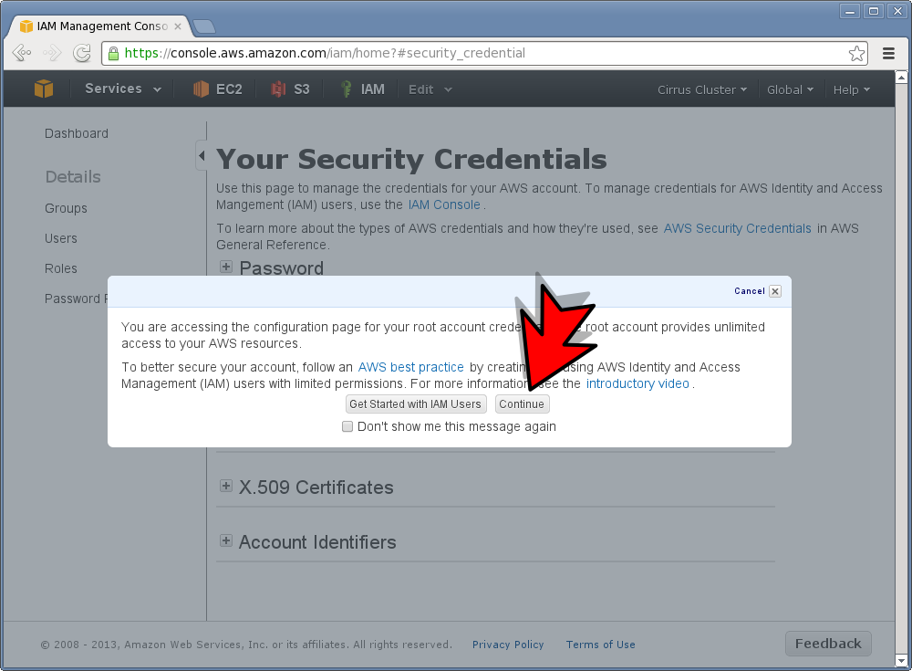
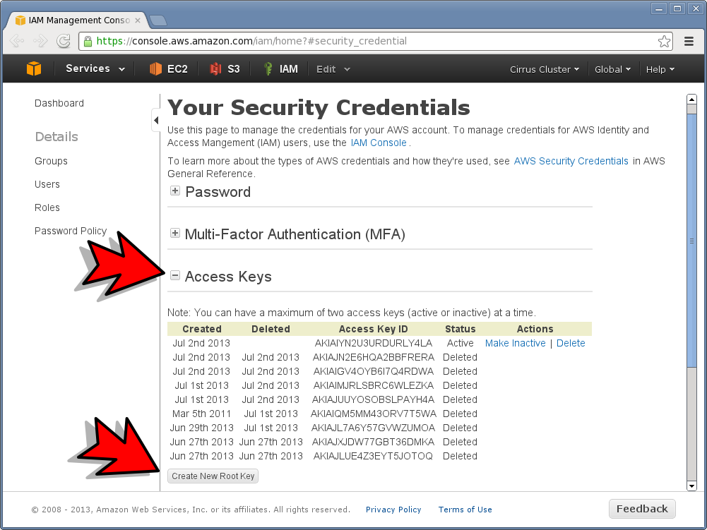
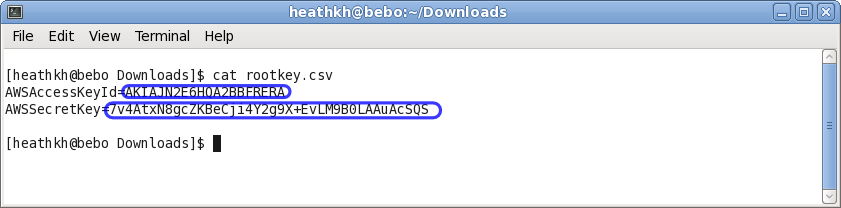

.. _how_to_get_aws_access_key:

******************************
How to get your AWS Access Key
******************************

Go to https://console.aws.amazon.com

Click on your username in the top navigation bar and then click the **Security Credentials** option in the drop down menu.  

""""""""""""""""""""""""""

Click the **Continue** button to dismiss the dialog.

""""""""""""""""""""""""""

Click the **+** button next to **Access Keys** and then click the **Create new root key** button.

""""""""""""""""""""""""""

<<<<<<< HEAD
=======
Click the **+** button next to **Access Keys** and then click the **Create New Root Key** button.

   
""""""""""""""""""""""""""

>>>>>>> branch 'master' of https://github.com/heathkh/iwct.git
Click the **Download key file** button.

.. image:: _static/how_to_get_key_download.png
   :width: 100%
   :align: center

""""""""""""""""""""""""""

Open the downloaded file **rootkey.svg** to copy and paste your Access Key ID and Secret.

