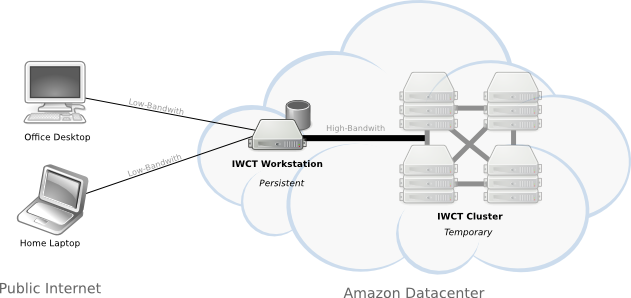

########################
Image Webs Cloud Toolkit
########################

The documentation explains how to build `Image Webs <http://graphics.stanford.edu/imagewebs>`_.

**Who is this for?**

The :ref:`tutorial <tutorial>` section is written for anyone who wants to visualize their own large-scale image collection as an image web. No programming is required. The :ref:`manual <manual>` section is for users who want to hack on the code of the matching pipeline used to build the image webs itself. All of the code is open source and available from `github <https://github.com/heathkh/iwct>`_.

**What is this?**

The Image Webs Cloud Toolkit (IWCT for short) creates a computing environment on Amazon's EC2 cloud with the Image Webs software pipeline installed and ready to use.  This environment consists of two elements: the workstation and the cluster.  You connect to the workstation from your local machine.  From the workstation, you can prepare your image datasets and launch a cluster to run the processing pipeline on your datasets.

*IWCT Computing Environment*

:workstation: A persistent remote workstation setup for you in the AWS cloud.

:cluster: A temporary cluster setup for you in the AWS cloud on-demand.

**How much does it cost?**

The IWCT software is opensource and free to use.  However, you pay amazon for whatever resources you use.  Roughly $1 per day to run the workstation and $6 per hour to run a typical cluster.  See the :ref:`estimating costs <costs>` section for details.

Contents
--------

.. toctree::
   :maxdepth: 2
   
   tutorial/tutorial
   manual/manual
   guides
   
   

