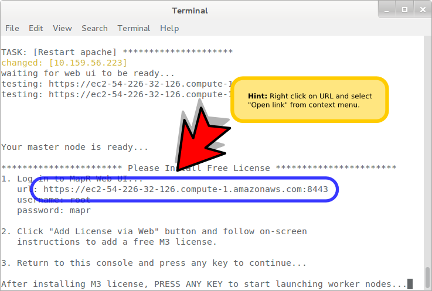
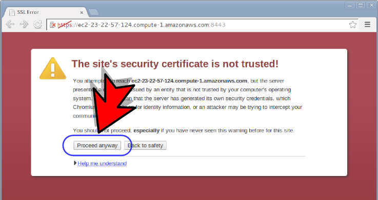
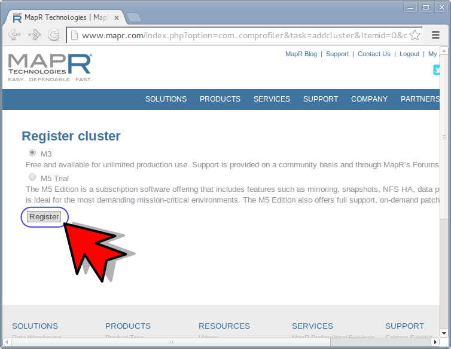
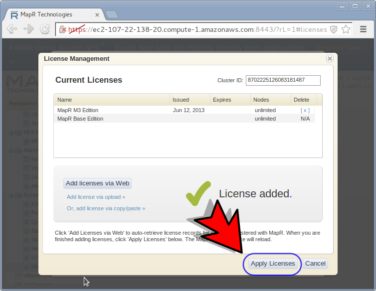
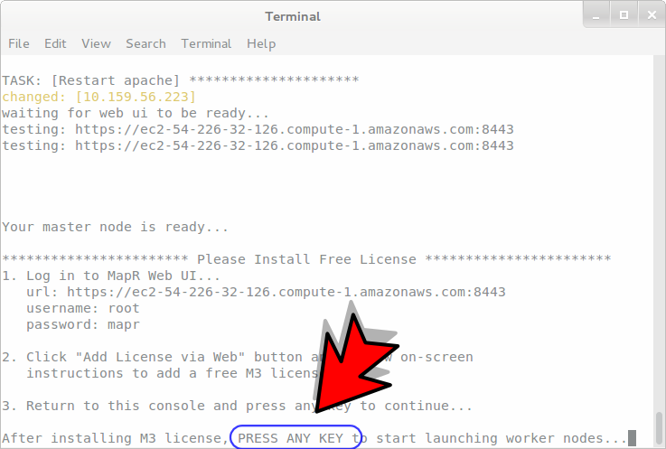

.. _launch_cluster:

**************
Launch cluster
**************

Open a terminal, and start a cluster with 5 nodes

.. code-block:: bash
  
  iwct_cluster create 5

When the prompt shows this message, open the url in a browser

.. hint::

  Hover and right click on the url and slect "open link in browser" from the context menu.

""""""""""""""""""""""""""

Click the *proceed anyway* button.

.. note:: You can safely ignore the scary looking SSL warning.

""""""""""""""""""""""""""

Login as the root user.

:Username: root

:Password: mapr

.. image:: _static/login.png

""""""""""""""""""""""""""

Click "add license from web"

.. image:: _static/add_license.png

""""""""""""""""""""""""""

If not yet done, create a Mapr account (set the remember me option to make this skip this step next time).

""""""""""""""""""""""""""

Select M3 license.

""""""""""""""""""""""""""

Click "Return to your MapR Cluster Ui" link

""""""""""""""""""""""""""

Click "Apply Licenses" Button

""""""""""""""""""""""""""

go back to console and press any key to continue...

""""""""""""""""""""""""""

When the script finishes, the MapR control panel should look like this (one green square for each node you requested).

